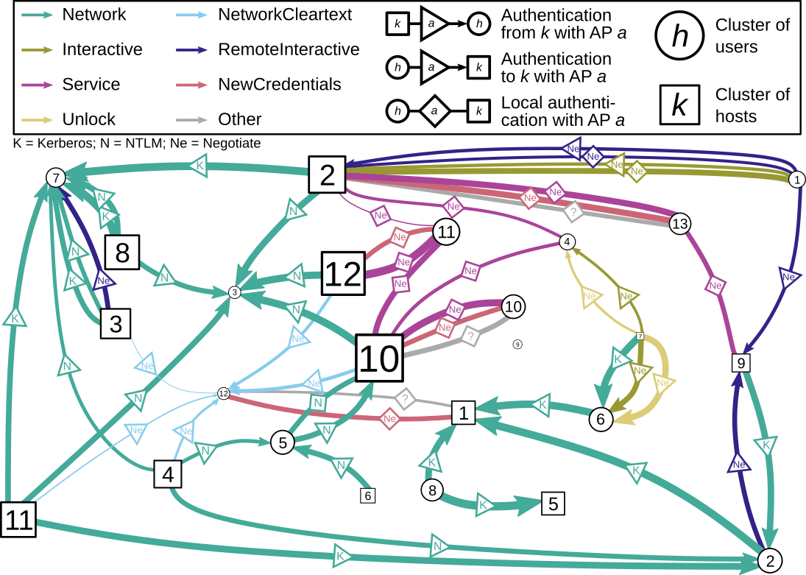

# Multilayer Block Models for Exploratory Analysis of Computer Event Logs



This repository contains the code associated with our paper
"Multilayer Block Models for Exploratory Analysis of Computer Event
Logs".
It also contains the data we used for our experiments, the complete
results of these experiments and Jupyter notebooks describing and
analyzing these results.

### Contents

There are four main directories:

* `code`: implementation of our multilayer Poisson latent block model,
  and Python script enabling its application to CSV-formatted datasets.
* `data`: preprocessed datasets used in our experiments.
* `results`: JSON files containing the complete results of our
  experiments (inferred clusters and model parameters).
* `notebooks`: Jupyter notebooks designed to help explore and
  understand the experiment results.

### Setup and requirements

The code is written in Python 3.9.
To install the necessary dependencies:
```
pip install -r requirements.txt
```
This is sufficient for running the model using the NumPy backend.
To use the PyTorch backend (including GPU support), you also need to
install [torch](https://pytorch.org/get-started/locally/) and
[torch-sparse](https://pypi.org/project/torch-sparse/).

### Usage

To reproduce the experiments presented in the paper:
```
$ cd code
$ python run_experiment.py --input_file ../data/vast.csv --output_dir ../results/ --backend torch --seed 0
$ python run_experiment.py --input_file ../data/lanl.csv --output_dir ../results/ --backend torch --seed 0
```
To apply the model to other datasets, see `data/` for examples of the
input format.
